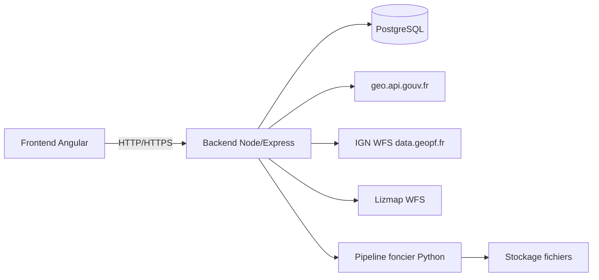

# Sites Cenca Backend

## Description
Ce dépôt contient le backend du projet webapp Angular de Sites Cenca, développé en NodeJS. Ce backend sert de fournisseur de données pour l'application.

## Installation
Les principales dépendances utilisées dans ce projet sont :

- axios
- bcrypt
- cors
- dotenv
- express
- jsonwebtoken
- pg

Pour installer les dépendances nécessaires, exécutez la commande suivante :
```bash
npm install
```

## Configuration
Assurez-vous de configurer les variables d'environnement nécessaires dans un fichier .env. Vous trouverez un exemple dans les fichiers racine.

## Utilisation
Pour démarrer le serveur, utilisez la commande suivante :
```bash
npm start
```

Contribution
Les contributions sont les bienvenues. Veuillez soumettre une pull request avec une description détaillée des modifications.

## Auteur
Nicolas ELIE pour le [Conservatoire d'Espaces Naturels Champagne-Ardenne](https://www.cen-champagne-ardenne.org).

## Version longue des fonctionnalités clés du projet

## Presentation projet
- Objectif : application web SIG pour la gestion et la valorisation des sites CENCA
- Public : equipe metier, partenaires, utilisateurs terrain
- Perimetre : Backend Node/Express + Frontend (Angular)

---

# Contexte & besoins
- Centraliser des donnees metiers + geographiques heterogenes
- Offrir un acces cartographique fluide et fiable
- Industrialiser les traitements fonciers (fichiers -> extraction -> restitution)

---

# Architecture generale
- Frontend Angular (UI + carto + workflows)
- Backend Node/Express (API + securite + SIG + traitements)
- PostgreSQL (donnees metier)
- Services externes SIG (geo.api.gouv.fr, IGN WFS, Lizmap)

## Schema d'architecture (Mermaid)



---

# Backend — role cle
- Fournisseur d'API unifiee pour le frontend
- Securisation des acces (JWT + blacklist)
- Orchestration des donnees SIG + traitements
- Exposition de GeoJSON compatible Leaflet/Map libs

---

# Donnees geographiques integrees
- Communes : geo.api.gouv.fr
- Cadastre : IGN WFS (data.geopf.fr)
- Donnees metiers SIG : Lizmap WFS (authentifie)
- Fusion des sources cote backend pour simplifier le frontend

---

# API GEO unifiee (exemples)
- Communes par departement
- Parcelles par bbox
- Parcelles par commune
- Couche Lizmap filtree par bbox ou codesite

---

# Traitement foncier automatise
- Upload de fichiers via API
- Traitement par script Python (pipeline foncier)
- Retour d'etat et integration dans le SI

---

# Securite & conformite
- JWT + blacklist en base
- CORS en allowlist
- Rate limiting global
- HTTPS en production

---

# Performance & robustesse
- Pool PostgreSQL avec keep-alive + reconnexion
- Timeouts et gestion d'erreurs WFS
- Cache d'images redimensionnees
- Observabilite Prometheus

---

# Documentation & support
- Documentation interne en Markdown servie en HTML
- Routes de debug / tests API
- Exemple d'integration rapide cote frontend

---

# Enjeux techniques majeurs
- Normaliser les flux SIG heterogenes
- Gerer la volumetrie geographique (bbox, maxFeatures)
- Fiabiliser les appels externes (timeouts, fallback)
- Assurer securite, observabilite, maintenabilite

---

# Valeur metier
- Acces carto fluide et a jour
- Reduction des manipulations manuelles
- Fiabilite et tracabilite des donnees foncieres
- Base solide pour futures extensions

---

# Roadmap possible
- Optimiser cache SIG / pagination
- Ameliorer l'UX carto
- Ajouter des controles metiers avances
- Industrialiser la CI/CD

---

# Conclusion
- Backend = coeur technique et interoperable
- Frontend = experience utilisateur orientee metier
- Projet pret pour montee en charge et evolutions

---

## Version courte des fonctionnalités clé.

# Sites CENCA - Backend & Frontend
- Objectif : application web SIG pour la gestion des sites
- Valeur : donnees fiables, workflow foncier, carto fluide

---

# Architecture generale
- Frontend Angular + Backend Node/Express
- PostgreSQL + services SIG externes

---

# SIG unifie
- Communes (geo.api.gouv.fr)
- Parcelles (IGN WFS)
- Donnees metier (Lizmap WFS)

---

# Traitement foncier
- Upload de fichiers
- Traitement Python automatise

---

# Securite & fiabilite
- JWT + blacklist
- CORS allowlist + rate limiting
- Timeouts WFS, gestion erreurs

---

# Impact metier
- Gain de temps et fiabilite
- Base solide pour evolutions
```